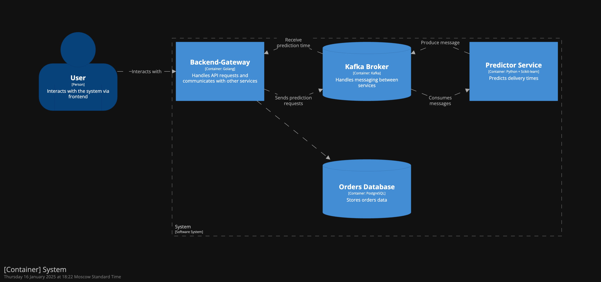

# DeliveryTimePrediction - сервис предсказания времени доставки в зависимости от условий

# Авторы

| ФИО               | Группа          |
|--------------------|-----------------|
| Катаев Юрий       | М80-410Б-21     |
| Куликова Анастасия | М80-410Б-21     |
| Цыкин Павел       | М80-410Б-21     |

# Презентация проекта

https://docs.google.com/presentation/d/1p5WcG8X9Cig24ZBOzoyLY_eVTPVThjmrjyxVMkeGS_c/edit#slide=id.p

# Отчет 

## Бизнес-цель

Бизнес-цель данного проекта заключается в разработке системы прогнозирования времени доставки на основе ключевых характеристик заказа, маршрута и внешних факторов. Продукт позволит повысить точность прогнозов, автоматизировать процесс расчета, сократить затраты на ручной анализ и улучшить клиентский опыт за счет предоставления более точной информации о времени получения заказов.

## ML-цель

## Обучение модели

Для обучения использовался датасет [Food Delivery time Analysis and Prediction](https://www.kaggle.com/code/a3amat02/food-delivery-time-analysis-and-prediction)

код представлен в файле [training.ipynb](training.ipynb)

метрики на тествой выборке
* MAE: 6.48
* MSE: 87.36
* RMSE: 9.35

## Архитектура

## Стек

- Go (backend-gateway): высокая производительность, низкое потребление ресурсов, простота написания конкурентного кода, идеально подходит для API и взаимодействия с БД.
- Python + FastAPI (predictor): быстрая разработка, удобство работы с ML-моделями, поддержка асинхронных операций, высокая читаемость кода.
- Kafka: надежная и масштабируемая система очередей для асинхронного обмена сообщениями между микросервисами, обеспечивает устойчивость к сбоям и высокую пропускную способность.
- PostgreSQL: реляционная БД с богатым функционалом, поддержкой сложных запросов и высокой надежностью, хорошо подходит для хранения структурированных данных.

